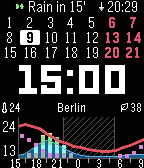
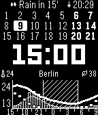
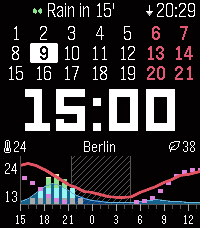

  

A weather watchface for Pebble inspired by ForecasWatch2, with a 24-hour forecast, a 3-week calendar, health tracking, and rain radar.

## Screenshots

| Pebble Time                                                                                       | Pebble 2 Duo                                                                                       | Pebble Time 2                                                                                      |
|---------------------------------------------------------------------------------------------------|----------------------------------------------------------------------------------------------------|----------------------------------------------------------------------------------------------------|
|  |  |  |

## Features

**Forecast**
* 24-hour forecast with a temperature line and configurable, battery-friendly updates
* Configurable metrics such as precipitation, UV index, gusts, wind, air pressure, and feels-like temperature (drawn as a muted second line on the temperature scale)
* Optional day/night shading
* Recolor the forecast graph per metric
* Multiple weather providers, including regional and worldwide sources

**Rain radar**
* 2-hour precipitation nowcast from regional and worldwide providers
* Rain countdown telling you when rain starts (or stops)
* Choose how much radar you see — Off, a rain countdown, a radar status line, or the full radar graph — in the Radar tab

**Health view** *(requires a health-capable watch; heart rate needs a heart-rate sensor)*
* Health status for steps, sleep, distance, and heart rate
* Last-24h health chart with steps per hour, heart rate on a scale you set, and a sleep band

**Calendar**
* Multi-week calendar with current-day highlight
* Selectable start of week and customizable highlights for weekends and holidays (150+ countries)

**Status lines**
* Configurable status slots on every view: fill each slot from a catalog of metrics — weather, dew point, air quality, pollen, wind, health, watch battery (glyph or percentage), phone battery, a countdown to any date, and more
* Selectable date format for the date slot — German/European, US, ISO, and spelled-out-month styles, chosen separately for calendar views (month + year) and no-calendar views (full date)
* Threshold highlighting: bold, outline, or fill a status slot when a metric crosses a warn or danger level you set

**Watchface themes**
* Dark and Light, plus Black & White options on color watches

**Watch**
* Custom color, 12h/24h, optional AM/PM
* Battery, Bluetooth, quiet time, and vibrate-on-disconnect indicators
* Night battery saver (pause updates to the watch overnight to save battery)

**Layout customization**
* Multiple layout presets, with flick-to-cycle between views and optional auto-return
* Light/Dark settings page with grouped, easy-to-browse pickers
* First-run setup wizard that picks sensible defaults for your country and watch — it bolds the rows you read first, gives air quality a warn outline, and puts steps on the top row when your watch has health

*Weather and radar data from [MET Norway](https://www.met.no/) is used under [CC BY 4.0](https://creativecommons.org/licenses/by/4.0/).*

## Forecast graph vs. rain radar

Two things that both involve rain over time, but answer different questions:

- **Forecast graph** — the hourly prediction, looking up to 24 hours ahead. Temperature is
  always shown; on top of it you choose what to add — precipitation %, wind speed, wind gusts,
  UV index, air pressure (sea-level, in hPa, with a Narrow/Mid/Wide graph scale), or feels-like
  temperature (drawn muted on the same scale as the temperature curve) as a main
  metric (solid line) and an optional second metric (drawn as bar-aligned square dots; the same
  metric can't appear on both), plus optional bars for the hourly rain amount. The temperature
  status slot can also show the feels-like value, or both as `12/10`.
- **Rain radar** — unlike the forecast graph's model prediction, this is a short-term nowcast
  based on actual radar measurements moving toward you, refreshed often as new scans arrive.
  Instead of a map it's drawn as bars: the provider's radar images for the next 2 hours are
  sampled at your location, and each 5-minute frame becomes one bar whose height is the rain
  amount — solid bars are rain at your exact spot; with DWD, the hatched outline behind
  them is the strongest rain within 2 km. Available from DWD (Germany), Met.no (Nordics), Rainbow.ai
  (worldwide, exact location only) and Tomorrow.io (worldwide, needs a free API key). Good for *"is it about to rain on me right now?"*

## Platforms

Pebble Classic, Pebble Steel, Pebble Time, Pebble Time Steel, Pebble 2, Pebble 2 Duo, and Pebble Time 2 are supported.

## Installation

### Pebble Appstore

- RePebble: https://apps.repebble.com/67d6f1fcdb264341b850f79a
- Rebble: https://apps.rebble.io/en_US/application/6a3645239d979d000abc99db

If you're using the modern Pebble app, the RePebble listing should be the simplest install path. If you prefer the Rebble flow, follow https://help.rebble.io/setup to set up your Pebble app first. The RePebble store uses Rebble's backend ([blog](https://ericmigi.com/blog/re-introducing-the-pebble-appstore)), so they're effectively the same catalog through a different entry point.

### Manual install

If you want to sideload a specific build, use the modern Pebble app on [iOS](https://repebble.com/app) or [Android](https://repebble.com/app), which supports installing `.pbw` files directly. Download the latest [`warnweather.pbw`](https://github.com/Toasbi/WarnWeather/releases/latest/download/warnweather.pbw) release and install it with the app.

## Developers

See [CONTRIBUTING.md](CONTRIBUTING.md) for developer setup and workflow.

## Telemetry

WarnWeather includes privacy-respecting telemetry. I do not collect precise location or API keys. Account and watch identifiers are stored only as server-side HMAC hashes—enough for rough usage stats (e.g. DAU), not as readable IDs.

- Collected: each weather fetch’s outcome and duration, provider, coarse country code when available, app and watch metadata, and an allowlist of non-sensitive settings.
- Not collected: coordinates (lat/lon), city/state, manual location strings, your API keys, or any health data — your steps, sleep, and heart-rate readings never leave the watch.
- Purpose: estimate DAU, see coarse country mix, spot weather-fetch failures, and learn which settings are common.
- You may opt-out of telemetry by disabling it in the settings.
